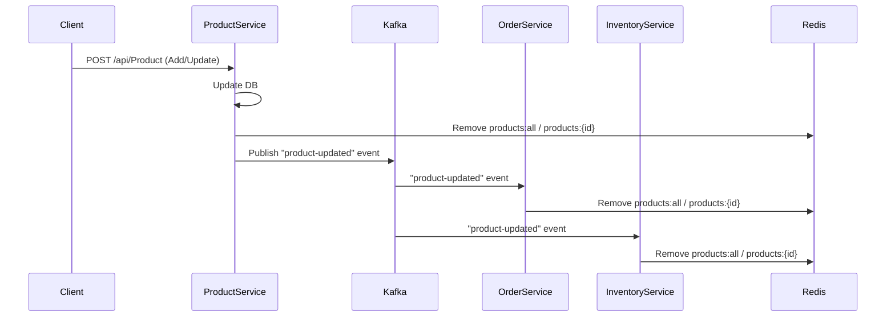

# 🚩พัฒนา Microservices (Product, Order, Inventory) พร้อม Redis Cache, Kafka Event, Clean Architecture
#
Redis Cache &amp; Kafka กลยุทธ์ในการจัดการข้อมูลใน Microservices อย่างรวดเร็วและมีประสิทธิภาพ
#

สร้างระบบ Microservices (.NET 8) แบบแยก Service พร้อม Redis Cache, Kafka, Dapper, Clean Architecture, Docker Compose
โดยเน้น “**Cache Invalidation with Kafka Event**”

#

---

## 1. 📚 แนวคิดและสถาปัตยกรรม

* **Microservices**: แยกแต่ละ Service (Product, Order, Inventory) มีฐานข้อมูลและโค้ดเป็นของตัวเอง
* **Clean Architecture**: แบ่ง Layer ชัดเจน Domain / Application / Infrastructure / API
* **Redis Cache**: ใช้ Cache Aside Pattern (แต่ละ Service แคชข้อมูลของตัวเอง TTL 5-10 นาที)
* **Kafka**: สื่อสารระหว่าง Service แบบ Event-Driven (Publish/Subscribe Event)
* **Cache Invalidation**: เมื่อมีการเปลี่ยนแปลงสินค้า (Create/Update) ใน ProductService → ส่ง Event ไปยัง Order/InventoryService เพื่อลบ Cache ที่เกี่ยวข้อง

---

## 2. 🏗️ โครงสร้างโปรเจกต์ (Project Structure)

```plaintext
src/
  ProductService/
    ProductService.API/
    ProductService.Application/
    ProductService.Domain/
    ProductService.Infrastructure/
  OrderService/
    OrderService.API/
    OrderService.Application/
    OrderService.Domain/
    OrderService.Infrastructure/
  InventoryService/
    (โครงสร้างเหมือน OrderService)
docker/
  (ไฟล์ SQL init)
docker-compose.yml
sql/
  product_init.sql
  order_init.sql
  inventory_init.sql
README.md
```

---

## 3. ⚙️ เตรียมเครื่องมือ

* **.NET 8 SDK**
* **Docker Desktop (Windows/Mac/Linux)**
* **Visual Studio 2022** หรือ **VS Code**
* **Postman/Swagger** สำหรับทดสอบ API

---

## 4. 🐳 เตรียม Docker Compose และฐานข้อมูล

**docker-compose.yml**
รวม Kafka, Zookeeper, Redis, MSSQL (แต่ละ Service), Kafdrop UI

> **สร้างไฟล์ `docker-compose.yml`**
> ดูตัวอย่างใน [โพสต์นี้](#4-docker-compose-ตัวอย่าง-production-ready-environment-variables)
> (หรือเลื่อนกลับขึ้นไปด้านบน)

**sql/product\_init.sql**

```sql
CREATE DATABASE ProductDb;
GO
USE ProductDb;
CREATE TABLE Products (
  Id INT PRIMARY KEY IDENTITY,
  Name NVARCHAR(100),
  Description NVARCHAR(255),
  Price DECIMAL(18,2),
  UpdatedAt DATETIME DEFAULT GETDATE()
);
```

*สร้างไฟล์คล้ายกันสำหรับ Order/Inventory*

**สั่งรันทุกอย่าง**

```bash
docker-compose up -d
```

---

## 5. 📦 สร้างแต่ละ Service ตาม Clean Architecture

**แต่ละ Service มี 4 Layer:**

* **Domain**: Entity, Event
* **Application**: Interface, Service (Logic)
* **Infrastructure**: Repository, Redis, Kafka
* **API**: Controller, Program

### ตัวอย่าง ProductService (ย่อ)

* `ProductService.Domain/Entities/Product.cs`
* `ProductService.Domain/Events/ProductUpdatedEvent.cs`
* `ProductService.Application/Interfaces/IProductRepository.cs`
* `ProductService.Application/Interfaces/IRedisCacheService.cs`
* `ProductService.Application/Interfaces/IKafkaProducer.cs`
* `ProductService.Application/Services/ProductService.cs`
* `ProductService.Infrastructure/Repositories/ProductRepository.cs`
* `ProductService.Infrastructure/Redis/RedisCacheService.cs`
* `ProductService.Infrastructure/Kafka/KafkaProducer.cs`
* `ProductService.API/Controllers/ProductController.cs`
* `ProductService.API/Program.cs`
* `ProductService.API/appsettings.json`

> **OrderService, InventoryService** โครงสร้างเหมือนกัน (เปลี่ยนชื่อ Entity และ Repository เท่านั้น)

---

## 6. 🛠️ ติดตั้ง NuGet Packages (ทุก Service)

```bash
dotnet add package Dapper
dotnet add package Confluent.Kafka
dotnet add package StackExchange.Redis
dotnet add package Microsoft.Data.SqlClient
dotnet add package Swashbuckle.AspNetCore
```

---

## 7. 👨‍💻 การเขียนโค้ด (ตัวอย่าง/หลักสำคัญ)

#### 7.1 ProductService.Domain/Entities/Product.cs

```csharp
public record Product(int Id, string Name, string Description, decimal Price, DateTime UpdatedAt);
```

#### 7.2 ProductService.Application/Services/ProductService.cs

```csharp
public class ProductService : IProductService
{
    // ...Constructor (DI)
    public async Task<IEnumerable<Product>> GetAllAsync()
    {
        var cacheKey = "products:all";
        var cached = await _cache.GetAsync<IEnumerable<Product>>(cacheKey);
        if (cached != null) return cached;
        var products = await _repo.GetAllAsync();
        await _cache.SetAsync(cacheKey, products, _ttl);
        return products;
    }
    public async Task<int> AddOrUpdateAsync(Product product)
    {
        var id = await _repo.AddOrUpdateAsync(product);
        await _cache.RemoveAsync("products:all");
        await _cache.RemoveAsync($"products:{id}");
        await _producer.PublishProductUpdatedAsync(new ProductUpdatedEvent { ProductId = id, UpdatedAt = DateTime.UtcNow });
        return id;
    }
}
```

#### 7.3 ProductService.Infrastructure/Kafka/KafkaProducer.cs

```csharp
public async Task PublishProductUpdatedAsync(ProductUpdatedEvent evt)
{
    var config = new ProducerConfig { BootstrapServers = _config["Kafka:BootstrapServers"] };
    using var producer = new ProducerBuilder<Null, string>(config).Build();
    var message = JsonSerializer.Serialize(evt);
    await producer.ProduceAsync("product-updated", new Message<Null, string> { Value = message });
}
```

#### 7.4 OrderService.Infrastructure/Kafka/KafkaProductUpdatedConsumer.cs

```csharp
public class KafkaProductUpdatedConsumer : BackgroundService
{
    protected override async Task ExecuteAsync(CancellationToken stoppingToken)
    {
        // ... connect kafka, subscribe topic
        while (!stoppingToken.IsCancellationRequested)
        {
            var result = consumer.Consume(stoppingToken);
            var evt = JsonSerializer.Deserialize<ProductUpdatedEvent>(result.Message.Value);
            await _cache.RemoveAsync("products:all");
            await _cache.RemoveAsync($"products:{evt.ProductId}");
        }
    }
}
```

> InventoryService ใช้ logic เดียวกัน

---

## 8. 🚀 สั่งรันแต่ละ Service

* เปิดแต่ละ Service ด้วย `dotnet run` (ProductService.API, OrderService.API, InventoryService.API)
* เรียกดู Swagger:

  * Product: [http://localhost:5000/swagger](http://localhost:5000/swagger)
  * Order: [http://localhost:5001/swagger](http://localhost:5001/swagger)
  * Inventory: [http://localhost:5002/swagger](http://localhost:5002/swagger)
* ทดสอบ Create/Update Product → ตรวจสอบ Log/Cache → Kafdrop (localhost:9000)

---

## 9. 🔍 Sequence Diagram (Flow หลัก)



---

## 10. 📖 Best Practice/ข้อควรรู้

* แต่ละ Service มีฐานข้อมูลและ Cache เป็นของตัวเอง (Loose Coupling)
* การสื่อสารระหว่าง Service ใช้ Event (Kafka)
* Invalidate Cache เฉพาะ Key ที่เปลี่ยนแปลง (Cache Aside Pattern)
* TTL ควรตั้ง 5-10 นาที (ขึ้นกับ use-case)
* ใช้ ENV/Secret แยกพวก Password, Key (อย่าเขียนใน code!)
* Production: เพิ่ม Logging, Exception Middleware, HealthCheck, Auth

---

## 11. 🔗 ตัวอย่างไฟล์ .env (สำหรับ Production)

```env
# .env ตัวอย่าง
REDIS_PASSWORD=YourRedisStrongPassw0rd
MSSQL_PRODUCT_PASSWORD=YourStrong!Passw0rd
MSSQL_ORDER_PASSWORD=YourStrong!Passw0rd
MSSQL_INVENTORY_PASSWORD=YourStrong!Passw0rd
```

(ใน docker-compose.yml ให้ใช้ `${REDIS_PASSWORD}`)

---

## 12. 📑 ตัวอย่าง README.md (ย่อ)

```markdown
# Microservices Template (.NET8 + Kafka + Redis + Clean Architecture)

## Features
- แยก Service อิสระ (Product, Order, Inventory)
- Redis Cache Aside + TTL
- Event-driven Cache Invalidation ผ่าน Kafka
- Clean Architecture
- รองรับ Docker Compose, Kafdrop UI

## Quick Start
1. `docker-compose up -d`
2. Run Service: `dotnet run` ในแต่ละ API
3. ทดสอบ API และ Event Flow
4. ดู Log/Kafka event ที่ http://localhost:9000

## เพิ่มเติม
- อยากเสริม Logging, Unit Test, Auth หรือ Monitoring สามารถแยกเพิ่มในแต่ละ Layer ได้ทันที
```

---

## 13. 💡 สรุปเคล็ดลับสำหรับมือใหม่

* แนะนำให้ทดลองสร้าง **ProductService** ให้จบก่อน แล้วค่อย copy pattern ไป Order/Inventory
* ทุก Service สามารถพัฒนาและ deploy แยกกัน (ทดสอบง่าย, ยืดหยุ่น)
* ใช้ Postman/Swagger, ลองเปลี่ยนค่าใน DB แล้วเช็ค cache ดูความถูกต้อง
* หากแก้ code cache หรือ event แล้วอย่าลืม restart background service ที่ subscribe Kafka

---

## 14. ❓ ถ้ามีคำถาม หรือปัญหา

* ลองเช็ค Log ของ Service
* เช็ค Docker (status ของ container)
* ตรวจสอบ .env/.yml ให้ถูกต้อง
* ดู Event ด้วย Kafdrop

---

# 🎉 พร้อมลุย!

สามารถนำไปใช้งานจริง, ทำ Workshop, หรือประกอบบทความสอน/เทรนทีมได้เลย
**ถ้าอยากได้ไฟล์ตัวอย่าง, โครงสร้างโค้ด, Diagram หรืออธิบายโค้ดแต่ละส่วนแบบละเอียดกว่าเดิม แจ้งได้ตลอดครับ!**
